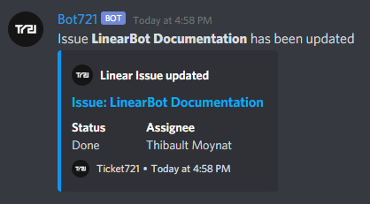

## Description

Discord bot for [Linear](https://linear.app/) made with [Nest](https://docs.nestjs.com/)
<p align="center">
  
</p>

## Getting started

Create an application on [Discord Developer Portal](https://discord.com/developers)  
Then create a bot and invite him in your server with correct rights  
Read [Documentation](https://discord.com/developers/docs/intro) for more information :blush:

Deploy the code and create [Linear Webhook](https://github.com/linearapp/linear/blob/master/docs/Webhooks.md) pointing at your server (HTTPS required)

Configure your server (.env file)
```
TOKEN=""            ## Discord client token
CHANNELID=""        ## Discord channel ID

LINEARAPI=""        ## Linear API Key

COMPANYNAME=""      ## Your name or company name
COMPANYLOGO=""      ## Your logo
```

Simply run the server :trophy:

```bash
$ yarn install
$ yarn start
```

## License

LinearBot is [MIT licensed](LICENSE).
